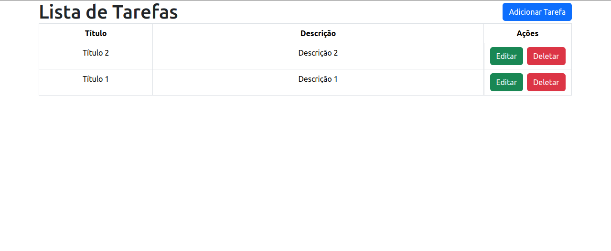
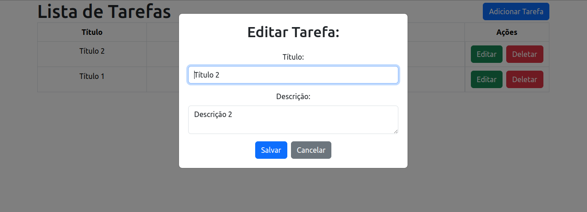

# crud-tarefas

Este é um projeto de CRUD de tarefas, foi feito como desafio proposto pela empresa Inforgeneses, desenvolvido usando a arquitetura MVC (Model-View-Controller) e tecnologias como Bootstrap, JavaScript, jQuery (Ajax), PHP e MySQL.

## Pré-requisitos

- Servidor web (ex: Apache)
- PHP
- MySQL

## Instalação

1. Clone este repositório para o seu servidor web(OBRIGATORIO)
2. Importar base de dados com backup.sql(OBRIGATORIO)

    ```bash
    cd /LOCAL_SERVIDOR/crud-tarefas
    mysql -u USUARIO -p < backup.sql
    ```

3. No arquivo config.php, alterar USER, PASS, DB, HOST de acordo com suas configurações(OBRIGATORIO).

   ```php
    define("HOST", 'localhost');
    define("DB", 'SEU BANCO DE DADOS');
    define("USER", 'SEU USUARIO SQL');
    define("PASS", 'SUA SENHA');

    define("DS", DIRECTORY_SEPARATOR); //separador
    define("DIR_APP", __DIR__); //raiz
    define("DIR_PROJECT", 'crud-tarefas');  //pasta do projeto
   ```

- Obs: Caso necessario pode alterar o nome do projeto no DIR_PROJECT(OPCIONAL).

## Funcionalidades

- Criação, leitura, atualização e exclusão de tarefas.
- Interface responsiva usando Bootstrap.
- Comunicação assíncrona com o servidor usando jQuery Ajax.
- Arquitetura MVC para organização e manutenção do código.

## Screenshot





